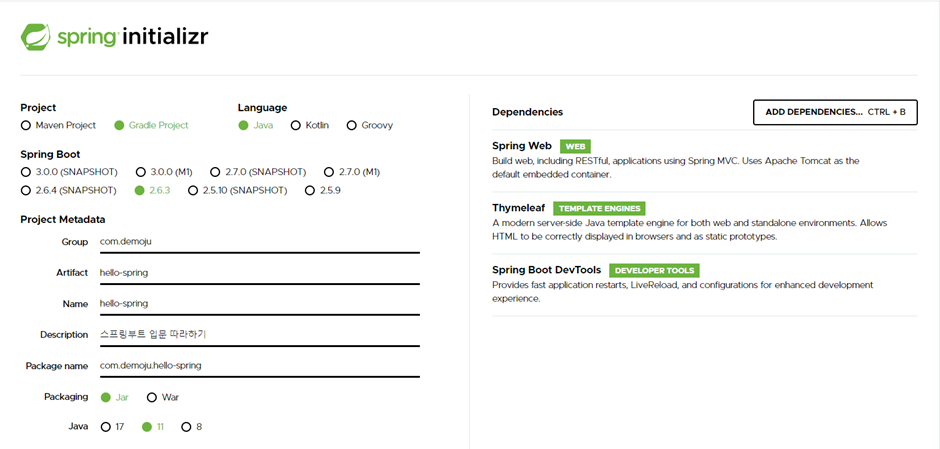
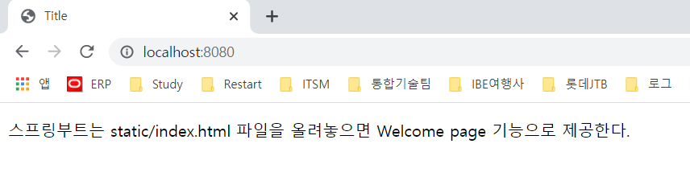

# 인프런 - 스프링 입문 따라하기

스프링 입문 - 코드로 배우는 스프링 부트, 웹 MVC, DB 접근기술 강의를 따라하면서 작성한 내용입니다.

* 인프런 : [https//www.inflean.com](http://www.inflean.com)

---

### 프로젝트 생성하기

***스프링부트 스타터*** 사이트로 이동하여 다음과 같이 스프링프로젝트를 생성.
* [https://start.spring.io](https://start.spring.io)

---

### 프로젝트 import 및 실행하기

유효한 단축키 

    Ctrl + Shiht + F10 : Run Application
    Ctril + F5 : ReRun

---

### View 환경설정

#### Welcome Page만들기

resources/static/index.html

    

---

## 스프링 DB 접근 기술

* H2 데이터베이스 설치
* 순수JDBC
* 스프링 통합 테스트
* 스프링 JdbcTemplate
* JPA
* 스프링 데이터 JPA

### H2 데이터베이스 설치

* [https://www.h2database.com](https://www.h2database.com)

### 순수JDBC
환경설정

build.gradle 에 추가

    implementation 'org.springframework.boot:spring-boot-starter-jdbc'
    runtimeOnly 'com.h2database:h2'

application.properties 에 추가 

    spring.datasource.url=jdbc:h2:tcp://localhost/~/test
    spring.datasource.driver-class-name=org.h2.Driver
    spring.datasource.username=sa

순수 JDBC 내용은 PASS

---
### JdbTemplate

---
### JPA

* JPA는 기존의 반복 코드는 물론이고, 기본적인 SQL도 JPA가 직접 만들어서 실행해준다.
* JPA를 사용하면 SQL과 데이터 중심의 설계에서 객체 중심의 설계로 패러다임을 전환할 수 있다.
* JPA를 사용하면 개발 생산성을 크게 높일 수 있다.

build.gradle 파일에 JPA, h2 데이터 베이스 관련 라이브러리를 추가한다.

    //implementation 'org.springframework.boot:spring-boot-starter-jdbc'
    implementation 'org.springframework.boot:spring-boot-starter-data-jpa'
    runtimeOnly 'com.h2database:h2'

application.properties 파일에 JPA 설정을 추가해준다

    spring.jpa.show-sql=true
    spring.jpa.hibernate.ddl-auto=none

spring.jpa.hibernate.ddl-auto=**none** none를 **create**로 변경하면 
다음과 같이 DB Table도 자동으로 생성해준다. 우왕 쩐다....

    Hibernate: drop table if exists jpa_mebmer CASCADE
    Hibernate: create table jpa_mebmer (id bigint generated by default as identity, name varchar(255), primary key (id))

---

### 스프링 Data JPA는 JPA를 충분히 이해하고 나중에 다시 봅시다.
